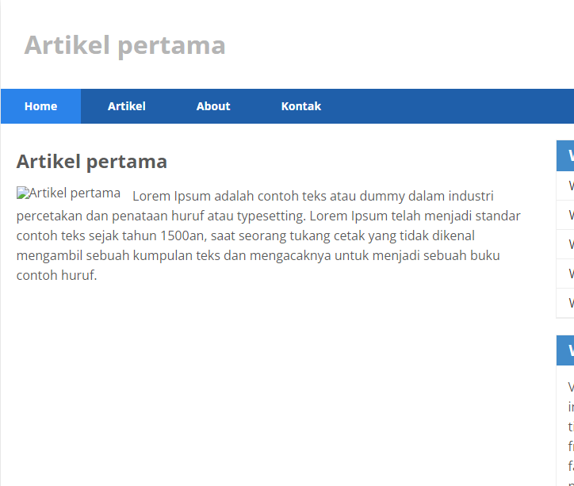

Membuat databases

      CREATE DATABASE lab_ci4;

Membuat table

      CREATE TABLE artikel (
        id INT(11) auto_increment,
        judul VARCHAR(200) NOT NULL,
        isi TEXT,
        gambar VARCHAR(200),
        status TINYINT(1) DEFAULT 0,
        slug VARCHAR(200),
        PRIMARY KEY(id)
        );

Konfigurasi koneksi database
Selanjutnya membuat konfigurasi untuk menghubungkan dengan database server. Konfigurasi dapat dilakukan dengan du acara, yaitu pada file app/config/database.php atau menggunakan file .env. Pada praktikum ini kita gunakan konfigurasi pada file .env.

Membuat Model
Selanjutnya adalah membuat Model untuk memproses data Artikel. Buat file baru pada direktori app/Models dengan nama ArtikelModel.php

Membuat Controller
Buat Controller baru dengan nama Artikel.php pada direktori app/Controllers.

Membuat View
Buat direktori baru dengan nama artikel pada direktori app/views, kemudian buat file baru dengan nama index.php.

Kemudian coba tambahkan beberapa data pada database agar dapat ditampilkan datanya.

      INSERT INTO artikel (judul, isi, slug) VALUE ('Artikel pertama', 'Lorem Ipsum adalah contoh teks atau dummy dalam industri percetakan dan penataan huruf atau typesetting. Lorem Ipsum telah menjadi standar contoh teks sejak tahun 1500an, saat seorang tukang cetak yang tidak dikenal mengambil sebuah kumpulan teks dan mengacaknya untuk menjadi sebuah buku contoh huruf.', 'artikel-pertama'), ('Artikel kedua', 'Tidak seperti anggapan banyak orang, Lorem Ipsum bukanlah teks-teks yang diacak. Ia berakar dari sebuah naskah sastra latin klasik dari era 45 sebelum masehi, hingga bisa dipastikan usianya telah mencapai lebih dari 2000 tahun.', 'artikel-kedua');

sehingga akan ditampilkan hasilnya.

Membuat Tampilan Detail Artikel
Tampilan pada saat judul berita di klik maka akan diarahkan ke halaman yang berbeda. Tambahkan fungsi baru pada Controller Artikel dengan nama view().

Membuat View Detail
Buat view baru untuk halaman detail dengan nama app/views/artikel/detail.php.

Membuat Routing untuk artikel detail
Buka Kembali file app/config/Routes.php, kemudian tambahkan routing untuk artikel detail.

      $routes->get('/artikel/(:any)', 'Artikel::view/$1');

Membuat Menu Admin
Menu admin adalah untuk proses CRUD data artikel. Buat method baru pada Controller Artikel dengan nama admin_index().

Selanjutnya buat view untuk tampilan admin dengan nama admin_index.php

Tambahkan routing untuk menu admin seperti berikut:

Menambah Data Artikel
Tambahkan fungsi/method baru pada Controller Artikel dengan nama add().

Kemudian buat view untuk form tambah dengan nama form_add.php

Mengubah Data
Tambahkan fungsi/method baru pada Controller Artikel dengan nama edit().

Kemudian buat view untuk form tambah dengan nama form_edit.php

Menghapus Data
Tambahkan fungsi/method baru pada Controller Artikel dengan nama delete().

